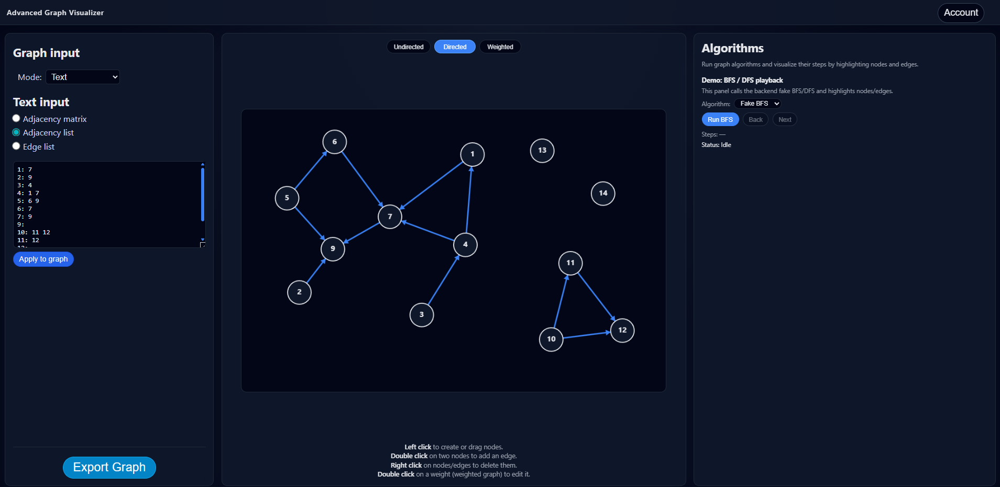

# Advanced Graph Visualizer (AGV)

<p align="center">
  
</p>

AGV is a full-stack playground for building and visualizing graphs and experimenting with algorithm executions.

- **Frontend:** React + TypeScript + Vite  
- **Backend:** FastAPI + Pydantic + SQLAlchemy (ready for persistence)  

The app is structured so that the frontend owns the UI and user interactions, and the backend exposes a clean API for algorithm runs and other future features.

---

## 1. Project structure

Repository root (simplified):

```text
Advanced-Graph-Visualizer/
├─ backend/
│  ├─ app/
│  │  ├─ api/         # FastAPI routers (HTTP endpoints)
│  │  ├─ db/          # SQLAlchemy base / models / session setup
│  │  ├─ schemas/     # Pydantic models (request / response)
│  │  ├─ services/    # Algorithm & business logic
│  │  └─ main.py      # FastAPI app entrypoint
│  ├─ requirements.txt
│  └─ .env (optional)
│
├─ frontend/
│  ├─ node_modules/   # Created by npm install
│  ├─ public/
│  │  └─ agv_logo.png # Favicon / logo
│  ├─ src/
│  │  ├─ api/         # HTTP client/helpers (for backend calls)
│  │  ├─ components/  # Reusable UI (graph canvas, sidebars, panels)
│  │  ├─ pages/       # Top-level pages (main graph editor, etc.)
│  │  ├─ styles/      # CSS
│  │  ├─ types/       # Shared TS types (graph + UI)
│  │  ├─ utils/       # Helpers
│  │  ├─ App.tsx      # Root React component
│  │  ├─ main.tsx     # React/Vite bootstrap
│  │  └─ index.css    # CSS imports
│  ├─ package.json
│  └─ vite.config.ts
│
└─ README.md
```

At a high level:

- **Backend** is organized by responsibility (API layer → schemas → services → db layer).  
- **Frontend** is organized by feature and type (components, pages, styles, shared types and utils).

---

## 2. Backend

The backend lives in `backend/app` and follows a classic layered FastAPI design:

- **`api/`** – Routers and endpoints  
  Example: an `algorithms` router that exposes endpoints such as:
  - `POST /api/algorithms/run` – create an algorithm run for a given graph.
  - `GET /api/algorithms/run/{run_id}/step/{index}` – fetch a specific step for playback.

- **`schemas/`** – Pydantic models  
  Used to validate and document:
  - Graph structure (nodes, edges, weights)
  - Algorithm runs (id, algorithm name, total steps)
  - etc.

- **`services/`** – Core logic  

- **`db/`** – SQLAlchemy configuration  
  Contains base/model definitions and session/engine helpers. This prepares the project to use persistence (SQLite or another database) without coupling it directly to the API layer.

- **`main.py`** – FastAPI app  
  - Instantiates the `FastAPI` application  
  - Configures CORS so the Vite dev server (e.g. `http://localhost:5173`) can call the API  
  - Includes the routers from `api/`

### 2.1. API documentation

FastAPI exposes Swagger UI automatically at:

- `http://localhost:8000/docs`

You can inspect request/response models and test requests directly from the browser.

---

## 3. Frontend

The frontend is in `frontend/` and is structured for clarity and reuse:

- **`src/components/`**
  - `graph/` – Graph-related components:
  - `login/` – Login-related UI (placeholder for future authentication)

- **`src/pages/`** Page-level containers such as `GraphEditorPage` that compose the main layout:
   

- **`src/styles/`** Here you will find the CSS files.

- **`src/types/`** Shared TypeScript types, for example:
   
- **`src/utils/`** Helper functions for:
  
- **`src/api/`**
  - Intended as a place to centralize HTTP clients (e.g. wrapping `fetch` or Axios).
  - Currently the UI may call `fetch` directly, but this folder is ready for future refactors.

- **`App.tsx`, `main.tsx`, `index.css`**
  - Standard React/Vite entry: mount the App into `#root` and apply global styling.

---

## 4. Installation & setup

### 4.1. Prerequisites

- **Node.js** (v18+ recommended)  
- **npm** (bundled with Node)  
- **Python** 3.10+  
- `pip` and a virtual environment tool (e.g. `python -m venv`)

---

## 5. Backend – install & run

From the project root:

```bash
cd backend
```

### 5.1. Create and activate virtual environment

**Windows (PowerShell):**

```bash
python -m venv .venv
.venv\Scripts\Activate
```

### 5.2. Install dependencies

```bash
pip install -r requirements.txt
```

If you update dependencies later, you can regenerate the file:

```bash
pip freeze > requirements.txt
```

### 5.3. Run the backend in development

```bash
uvicorn app.main:app --reload
```

The API will be available at:

- `http://localhost:8000`
- Swagger UI at `http://localhost:8000/docs`

---

## 6. Frontend – install & run

From the project root:

```bash
cd frontend
```

### 6.1. Install dependencies

```bash
npm install
```

This will create the `node_modules/` folder.

### 6.2. Start the development server

```bash
npm run dev
```

Vite will show a local URL such as:

```text
http://localhost:5173/
```

Open that in your browser. Make sure the backend (uvicorn) is also running so that API calls for algorithms work.

